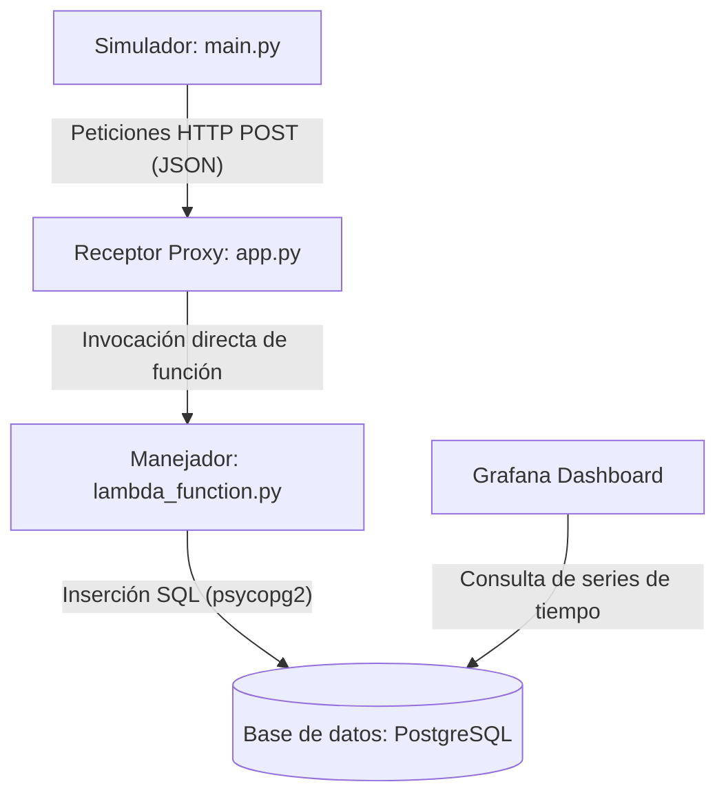

# Sistema Educativo de Telemetría IoT (Smart-Factory)

Este proyecto emula la telemetría de una planta industrial, transmitiendo datos simulados a la nube y visualizándolos en Grafana. Consta de 4 capas principales:

1. **Capa de Simulación**: Script en Python ejecutado en Docker que genera señales analógicas y digitales emulando sensores industriales.
2. **Capa de Transporte**: Envío de los payloads JSON mediante peticiones HTTP POST a un endpoint de AWS (API Gateway + Lambda).
3. **Capa de Almacenamiento**: Base de datos PostgreSQL en AWS RDS, optimizada para series de tiempo.
4. **Capa de Visualización**: Tablero en Grafana para monitorear en tiempo real los voltajes y estados lógicos de la maquinaria.

---

## Arquitectura y Flujo de Ejecución Local (Sin Conexión a AWS)

Para facilitar el desarrollo y las pruebas sin incurrir en costos de nube, el proyecto emula toda la arquitectura de AWS localmente mediante contenedores Docker. El flujo de interacción de los servicios locales es el siguiente:



### Funcionamiento de los Componentes Locales:

1. **Base de Datos Local**: El contenedor de PostgreSQL (`db`) levanta e inicializa la base de datos estructurada por el archivo [init.sql](file:///c:/Users/mikep/Desktop/smart-factory/database/init.sql).
2. **Receptor Local (Proxy Flask)**: En [app.py](file:///c:/Users/mikep/Desktop/smart-factory/receiver/src/app.py), levantamos un microservidor Flask en el puerto `8080` que emula el API Gateway de AWS, capturando las solicitudes y llamando directamente a la lógica de la Lambda local.
3. **Manejador de la Lambda**: En [lambda_function.py](file:///c:/Users/mikep/Desktop/smart-factory/aws/lambda_function.py), se procesan los datos de telemetría y se guardan en la base de datos PostgreSQL local en vez de AWS RDS.
4. **Simulador**: En [main.py](file:///c:/Users/mikep/Desktop/smart-factory/simulator/src/main.py), se generan señales senoidales (analógicas) y estados de encendido/fallas (digitales) cada 2 segundos, enviándolos al receptor Flask local.

---

## Requisitos y Configuración en Windows (WSL2)

El desarrollo está pensado para ejecutarse sobre Windows utilizando **WSL2** (Ubuntu/Debian) y **Docker Desktop**.

### 1. Activar integración de Docker con WSL2
- Instala Docker Desktop en Windows.
- Ve a **Settings > Resources > WSL Integration**.
- Asegúrate de habilitar la integración con tu distribución activa (ej. Ubuntu).

### 2. Variables de entorno
Copia el archivo `.env.example` a `.env` y configura tus variables locales:
```bash
cp .env.example .env
```

### 3. Ejecutar el Entorno Completo Local (Docker Compose)
Para levantar todo el ecosistema (PostgreSQL, Receptor Mock de Lambda, Simulador de Telemetría y Grafana auto-configurado):

Desde la terminal (PowerShell o WSL), ejecuta:
```bash
docker compose up --build
```

Esto levantará los siguientes servicios de manera automática:
* **PostgreSQL** (`localhost:5432`): Inicializado con la estructura de tablas de [init.sql](file:///c:/Users/mikep/Desktop/smart-factory/database/init.sql).
* **Mock Receiver** (`localhost:8080`): Expone la ruta `/telemetry` que recibe datos y ejecuta la lógica de [lambda_function.py](file:///c:/Users/mikep/Desktop/smart-factory/aws/lambda_function.py) localmente.
* **Simulator**: Empieza a generar la telemetría e hilos de datos y los envía al receptor.
* **Grafana** (`localhost:3000`): Inicia con el DataSource de PostgreSQL pre-configurado y el dashboard precargado de forma automática (credenciales por defecto: `admin/admin`)